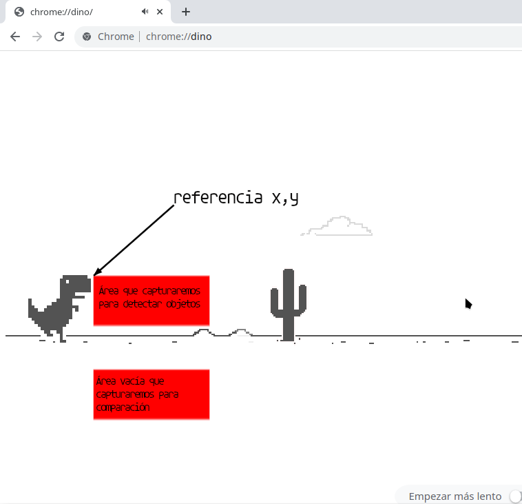

# Bot para el juego Dino de Chrome

Inspirado en el ejemplo visto en 
https://www.youtube.com/watch?v=DruSMCMQxCA

El navegador chrome nos ofrece un juego en los momentos que  nos quedamos sin conexión a internet, éste juego se llama dino y también puede ser llamado colocándo en la barra de navegación la dirección **chrome://dino**

La idea de este ejercicio es hacer un sencillo bot que intente jugar a este juego.

El objetivo del juego es poder sortear los obstáculos saltando los objetos que se presentan (en algunos casos se puede agachar para evitar los pájaros, pero también pueden ser saltados...)

Lo que haremos para detectar la presencia de obstáculos es mediante la librería **PIL** tomar capturas de dos áreas de la pantalla, una frente al dinosaurio y otra en un espacio vacío, y con la ayuda de la librería **numpy** cuantificaremos ambas imágenes, es decir, le daremos un valor numérico según el color de cada píxel, la imagen vacía nos servirá como referencia para restar ambos valores y saber si hay una diferencia, esto nos indicará que en la imagen de muestra hay un objeto (por lo tanto deberíamos saltar).

Cabe aclarar que de acuerdo a que cada pantalla tiene diferentes resoluciones es necesario tener antes de probar el bot una referencia de donde se ubicará el área de muestra, esto se puede hacer facilmente realizando una captura de pantalla y abriendo dicha captura con algún programa de edición donde se podrá observar las coordenadas del cursor y con eso nos ayudaremos para saber que valores de *x* e *y* usaremos para nuestro caso particular.

Para realizar el salto simularemos algunas teclas presionadas con la librería **pyautogui**.